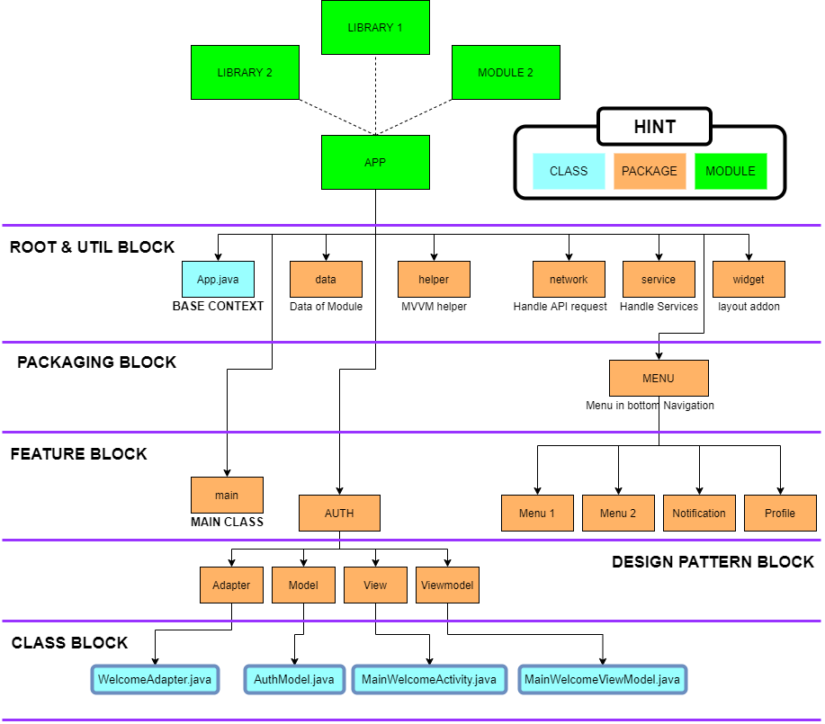

# DOT - Android Guidelines
> Guideline for android developer in Distinction On Technology (PT. DOT Indonesia)

Table of contents🧾
=================
<details>
<summary>Click to show</summary>
  
- [DOT - Android Guidelines](#dot---android-guidelines)
- [Table of contents](#table-of-contents)
  * [Guidelines](#guidelines)
  * [3rd Party Libraries](#3rd-party-libraries)
  * [Package diagram](#package-diagram)
    + [Java](#java)
    + [Resource](#resource)
- [Naming CheatSheet](#naming-cheatsheet)
  * [General Naming](#general-naming)
  * [JAVA](#java)
    + [Variable declaration Order](#variable-declaration-order)
  * [Resources](#resources)
    + [Layout ('WHAT_WHERE')](#layout---what-where--)
    + [Layout resource IDs (WHAT_WHERE_DESCRIPTION)](#layout-resource-ids--what-where-description-)
- [Linking resources directories tutorial](#linking-resources-directories-tutorial)
  * [References](#references)
- [DOT Indonesia](#dot-indonesia)

</details>

## Guidelines 
Please refer to this document to meet our style guidelines:
- https://github.com/ribot/android-guidelines/blob/master/project_and_code_guidelines.md

Always push your code into **develop** branch, and do a **merge request** into **master** branch after stabilize and refactor your code

Create your own branch for each feature of the apps

## 3rd Party Libraries 📖
Always use the libraries from these repository:
- https://github.com/pt-dot/awesome-dot

## Package diagram 
### Java 🛠



### Resource 🧱
Separate resource for each features


```
res-feature
    │  
    ├─── auth (features name)
    │   │
    │   ├───  layout
    │   │    └─ Layout inside package
    │   │
    │   └───  values
    │        └─ String inside package
    │   
    ├─── main (main package)
    │
    ├─── menu (menu package)
    │
    │─── widget (widget package) 
    │
    ├─── layout (layout that used multiple times i.e. partial layout)
    │
    └─── values (values contains more than one time, tools i.e (lorem, image url), never used)
        ├───  attrs
        ├───  colors
        ├───  dimens
        ├───  other values
        ├───  strings
        └───  styles
```

# Naming CheatSheet
> Standard name declaration to collaborate with other

- ## General Naming 🎉
    | Type              | Usage                 | Example                |
    | ----------------- | ----------------------| -----------------------|
    | Class             | PascalCase            | `MainActivity`         |
    | Local Variable    | camelCase             | `imageView`            |
    | Constants         | UPPER_SNAKE_CASE      | `BASE_URL`             |
    | Resource          | lower_snake_case      | `activity_main`        |
    | Resource  IDs     | camelCase             | `ivMain`               |

- ## JAVA
    ### Variable declaration Order ⏳

    | Type              | Prefix                                    | Example                   |
    | ----------------- | :--------------------:                    | :---------------------:   |
    | View              | (viewType ViewID)                         | `ivSplash`                |
    | Object            | (Object Name)                             | `network`                 |
    | ViewModel         | ---                                       | `viewModel`               |
    | Binding           | binding(`Binding Name` if more than one)  | `bindingMain` or `binding`| 
    | Constants         | WHERE_WHAT                                | `NETWORK_REQUEST_CODE`    |

- ## Resources
    > Resource Naming Based `'WHAT'_ 'WHERE'_ 'DESCRIPTION'`

    | WHAT              | WHERE            |	DESCRIPTION                         |
    | ------------      | :---------------:|:------:                                |
    | FIXED (btn, rv)   | LOCATION         | difference multiple 'WHAT' in 'WHERE'  |

    ### Layout ('WHAT_WHERE') 🖼
    
    | Component        | Class Name                      | Layout Name                              |
    | -----------------| :------------------------------:| :---------------------------------------:|
    | Activity         | `MainBroadcastMessageActivity`  | `activity_main_broadcast_message.xml`    |
    | Fragment         | `FragmentHome`                  | `fragment_home.xml`                      |
    | Dialog           | ---                             | `dialog_rating.xml`                      |
    | Adapter          | `ForumImageAdapter`             | ---                                      |
    | AdapterView item | ---                             | `item_forum_image.xml`                   |
    | Partial layout   | ---                             | `view_aduan_location.xml`                |

    ### Layout resource IDs (WHAT_WHERE_DESCRIPTION) 🧲
    
    | Component                 | Prefix      | Example                       |
    | --------------            | :------:    | :---------------------:       |
    | Button                    | `btn`       | `btnRegisterSignup`           |
    | TextView                  | `tv`        | `tvWelcomeTitle`              |
    | EditText                  | `et`        | `etLoginPassword`             |
    | ImageView                 | `iv`        | `ivSplashLogo`                |
    | RelativeLayout            | `rl`        | `rlMainRoot`                  |
    | LinearLayout              | `ll`        | `llLoginRoot`                 |
    | ConstraintLayout          | `cl`        | `clSplashRoot`                |
    | TableLayout               | `tl`        | `tlDetailSheet`               |
    | TabLayout                 | `tab`       | `tabMainNav`                  |
    | ListView                  | `lv`        | `lvDetailMessages`            |
    | RecyclerView              | `rv`        | `rvChat`                      |
    | Checkbox                  | `cb`        | `cbLoginRememberMe`           |
    | ProgressBar               | `pb`        | `pbRegisterUploadPercent`     |
    | RadioGroup                | `rg`        | `rgInputGender`               |
    | RadioButton               | `rb`        | `rbInputFemale`               |
    | ToggleButton              | `tb`        | `tbControlVisibility`         |
    | Spinner                   | `spin`      | `spinEditProfileLocation`     |
    | Menu                      | `menu`      | `menuMainSearch`             |
    | GalleryView               | `gv`        | `gvMainAlbum`                 |
    | WebView                   | `wv`        | `wvMainPreview`               |
    | Bottom Navigation         | `botnav`    | `botNavMain`                  |
    | Library Layout            | `lib`       | `libMainBotNav`               |
    | Custom Widget             | `wg`        | `wgMainGridRv`                |
    | Layout Binding ViewModel  |  ---        | `vm`                          |

    ### Drawables (WHERE_WHAT_DESCRIPTION) 🎨
    
    | Asset Type   | Prefix (WHAT)     |		Example                 |
    | ------------ | :---------------: |:-------------------------:     |
    | Action bar   | `ab_`             | `main_ab_login.9.png`          |
    | Button       | `btn_`	           | `login_btn_send_pressed.9.png` |
    | Background   | `bg_`             | `login_bg_dialog_top.9.png`    |
    | Dialog       | `dialog_`         | `all_dialog_top.9.png`         |
    | Divider      | `divider_`        | `all_divider_horizontal.9.png` |
    | Icon         | `ic_`	           | `splash_ic_star.png`           |
    | Notification | `notification_`   | `login_notification_bg.9.png`  |
    | Tabs         | `tab_`            | `main_tab_pressed.9.png`       |

    ### Icons (WHAT) 🎨
    
    | Asset Type                      | Prefix           | Example                    |
    | --------------------------------| :--------------: | :------------------------: |
    | Icons                           | `ic_`            | `ic_star.png`              |
    | Launcher icons                  | `ic_launcher`    | `ic_launcher_calendar.png` |
    | Menu icons and Action Bar icons | `ic_menu`        | `ic_menu_search.png`       |
    | Status bar icons                | `ic_stat_notify` | `ic_stat_notify_msg.png`   |
    | Tab icons                       | `ic_tab`         | `ic_tab_recent.png`        |
    | Dialog icons                    | `ic_dialog`      | `ic_dialog_info.png`       |
    
    ### Strings(WHERE_DESCRIPTION) 🧵
    
    | TYPE                              | Location                        | Prefix           | Example                                                                                        |
    | --------------------------------  |:-:                              | :--------------: | :--------------------------------:                                                             |
    | More than one features/package    | root                            | `all_`           | `all_et_hint_name`                                                                             |
    | Menu title                        | feature location                | `menu_`          | `fragment_list_menu_search.png`                                                                |
    | action                            | feature location                | `act_`           | `login_act_clicked`                                                                            |
    | error warning success message     | feature location                | `msg_`           | `network_msg_upload_success`                                                                   |
    | label                             | root                            | ---              | `all_name`                                                                                     |
    | view inside layout                | feature location                | `view prefix_`   | `splash_tv_description`                                                                        |
    | app_name                          | gradle/productFlavors           | ---              | `resValue "string", "app_name", "Dev"`                                                         |
    | API ENDPOINT                      | gradle/productFlavors           | ---              | `buildConfigField "String", "END_POINT", "\"https://sandbox.dot.co.id/project-name/api/v1/\""` |
    
    Gradle string Location is used for changed productFlavor i.e `development` `staging` `production`
    
    
# Linking resources directories tutorial 📌
 - Set Hierarchy view from android to Project
 - create directory `res-features` in `app/src/main`
 - create directory for each features in `res-features`
 - Go to build.gradle `app level`
 - add this in the android section
    ```groovy
     android {
     ...
        sourceSets {
            main {
                res.srcDirs = [
                    'src/main/res',
                    'src/main/res-features',
                    'src/main/res-features/main',
                    'src/main/your-path',
                ]
            }
        }
     }
    ```
 - Sync project with gradle


# References 🖥
- https://github.com/ribot/android-guidelines/blob/master/project_and_code_guidelines.md
- https://google.github.io/styleguide/javaguide.html#s5.1-identifier-names
- https://jeroenmols.com/blog/2016/03/07/resourcenaming/


# DOT Indonesia
<a href="http://dot.co.id/">
  
</a>
